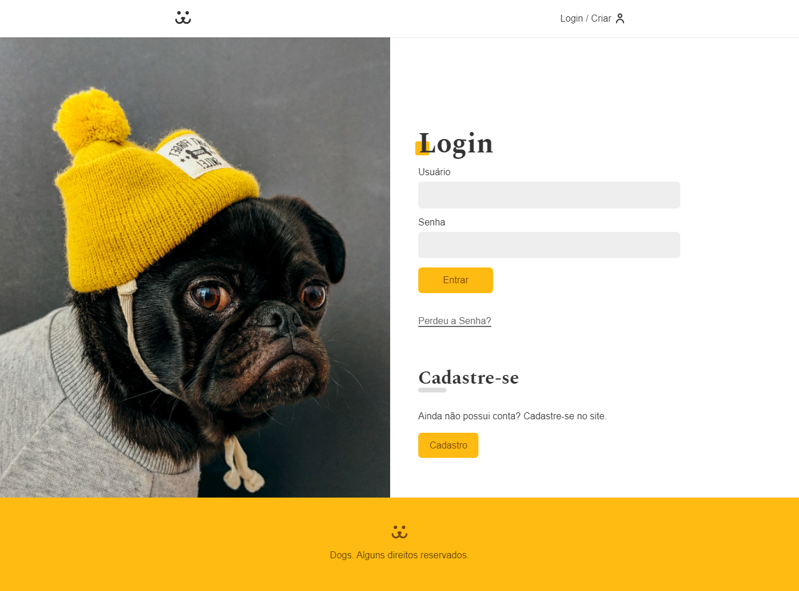
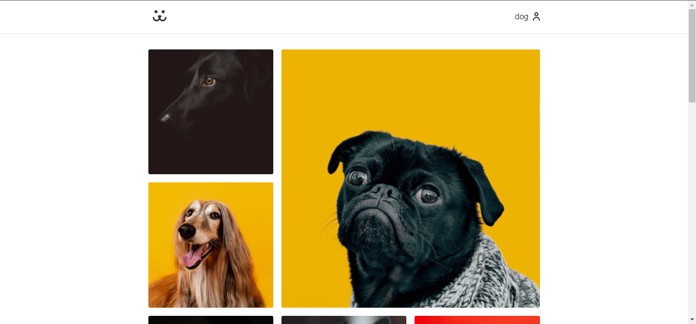

# Dogs - Rede Social para cachorros

  
  

## Projeto desenvolvido utilizando:
- Javascript
- React Js
- React-Router-Dom

### Projeto desenvolvido no curso de ReactJs da Origamid, sendo uma rede social para cachorros, na qual é possível cadastrar uma nova conta, adicionar fotos, deletá-las, comentá-las e mais. Também é possível ver as estatísticas da sua conta (número de likes, comentários, vizualizações).
